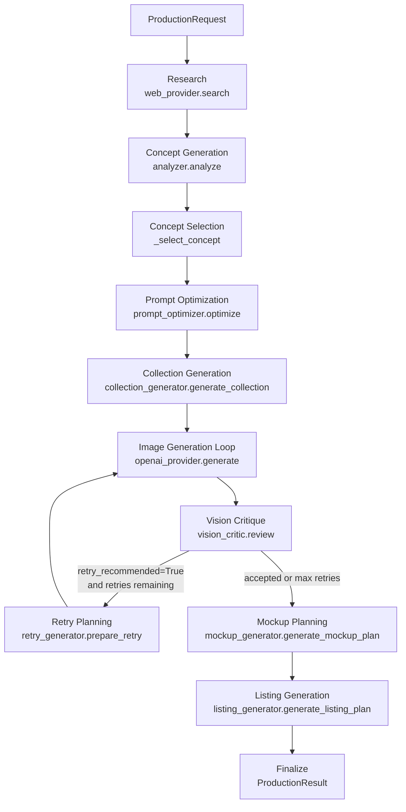
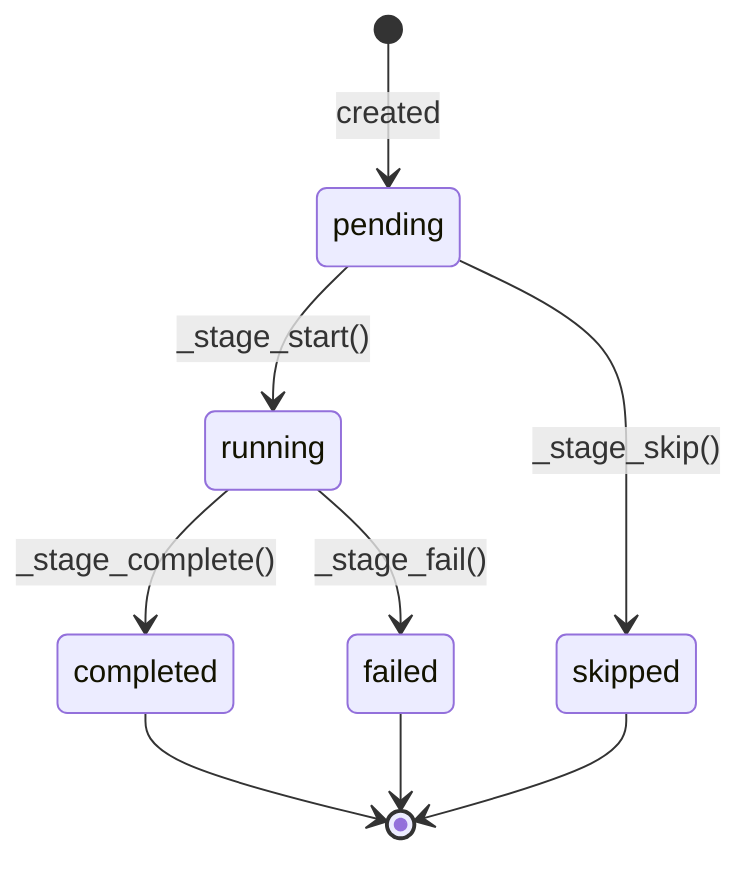

# How It Works

A technical walkthrough of the etsy-ai-agent pipeline for developers.

---

## Pipeline overview



All stages are orchestrated by `run_production()` in `agent/production_orchestrator.py`.

---

## Entry point

```python
# test_production.py
from agent.production_orchestrator import ProductionRequest, run_production

request = ProductionRequest(
    query="cozy anime wall art",
    collection_size=3,        # 3–8 posters
    output_root="outputs",
    selected_concept_index=None,  # None = auto-select first concept
    max_image_retries=1,
    skip_mockups=False,
    skip_listing=False,
)
result = run_production(request)
```

`run_production()` accepts an optional `_deps: ProductionDependencies` parameter — a test seam for injecting fakes without touching the network.

---

## Stage-by-stage breakdown

### Stage 1 — Research

```python
# research/web_provider.py
class WebResearchProvider(ResearchProvider):
    def search(self, query: str, limit: int = 20) -> list[Product]:
```

Uses `ddgs` (DuckDuckGo) to fetch up to 20 results. Each result is normalized into a `Product` dataclass with `.to_dict()`.

**Offline alternative:** `research/mock_provider.py` returns 5 hardcoded cozy/anime products — used for local testing without internet.

---

### Stage 2 — Concept Generation

```python
# agent/analyzer.py
def analyze(products: list[dict]) -> dict:
    # Returns: {"poster_concepts": [...]}
```

Single Claude call. Returns 2 poster concept dicts, each with:
- `name`, `niche`, `art_style`
- `image_generation_prompt`
- `negative_prompt`

---

### Stage 3 — Concept Selection

```python
# agent/production_orchestrator.py
def _select_concept(concepts: list[dict], index: int | None) -> dict:
```

If `selected_concept_index` is `None`, picks `concepts[0]` deterministically.
If an index is provided (1-based), validates range and returns that concept.
Raises `ValueError("out of range")` for invalid indices.

---

### Stage 4 — Prompt Optimization

```python
# agent/prompt_optimizer.py
def optimize(concept: dict, image_prompt: str, negative_prompt: str) -> dict:
    # Returns: {"optimized_image_prompt": ..., "optimized_negative_prompt": ...}
```

Single Claude call. Python post-processes the negative prompt by appending `_NEGATIVE_ADDITIONS` — a hardcoded list of paper/border/watermark phrases — guaranteeing they're always excluded.

---

### Stage 5 — Collection Generation

```python
# agent/collection_generator.py
def generate_collection(
    concept: dict,
    optimized_prompt: str,
    optimized_negative_prompt: str,
    collection_size: int,
) -> CollectionPlan:
```

**Three-call architecture:**

1. **Bible call** — generates `CollectionBible` (shared style, palette, mood, typography rules)
2. **Poster batches** — generates posters in batches of 2 (`_BATCH_SIZE = 2`), injecting prior poster summaries into each batch prompt to prevent duplicates
3. **Evaluation call** — scores the full collection for cohesion

Each batch:
- Calls `_generate_batch()` → `_raw_call()` → `_parse_with_diagnostics()`
- On truncation (`_TruncatedResponseError`), retries once with `_COMPACT_SUFFIX`
- Validates with `_validate_batch()`: index integrity, cross-batch duplicate check (title, subject, unique_hook), tag count (exactly 13), full-bleed terms, prohibited paper phrases

```python
def _make_batches(size: int, batch_size: int = 2) -> list[list[int]]:
    # _make_batches(5) → [[1,2], [3,4], [5]]
```

---

### Stages 6/7/8 — Image Generation + Vision Critique + Retry

These three stages run as an interleaved per-poster loop:

```
for each poster:
    attempt 1:
        generate image  →  vision critique  →  retry plan
        if accepted or max retries reached → save final.png, break
    attempt 2 (if retry):
        generate image  →  vision critique  →  retry plan
        ...
```

**Image generation:**
```python
# image/openai_provider.py
class OpenAIImageProvider(ImageProvider):
    def generate(self, prompt: str) -> str:  # returns path to saved PNG
```
Uses `gpt-image-2`, 1024×1024, returns `b64_json` (no `response_format` parameter needed).

**Vision critique:**
```python
# agent/vision_critic.py
def review(poster_concept, optimized_prompt, optimized_negative_prompt, image_path) -> VisionReport:
```
Returns a `VisionReport` with 8 scored dimensions (1–10), `retry_recommended: bool`, and `final_recommendation: str` (PROCEED / PROCEED_WITH_IMPROVEMENTS / RETRY).

**Retry planning:**
```python
# agent/retry_generator.py
def prepare_retry(poster_concept, optimized_prompt, optimized_negative_prompt, vision_report) -> RetryPlan:
```
Returns `RetryPlan` with `should_retry: bool`, `revised_image_prompt`, `revised_negative_prompt`.

**Per-poster output:**
```
images/poster_01/
├── original.png          # attempt 1
├── attempt_2.png         # if retried
├── final.png             # copy of last attempt
├── vision_report_1.json
├── retry_plan_1.json
└── attempts.json         # AttemptRecord list
```

---

### Stage 9 — Mockup Planning

```python
# agent/mockup_generator.py
def generate_mockup_plan(collection_plan: CollectionPlan) -> MockupPlan:
```

Two-call architecture:
1. Individual mockup specifications (one per poster)
2. Collection mockup + hero mockup + evaluation

Compositing mode: artwork is referenced by poster index only — never redescribed. Claude specifies scene, furniture, lighting. Validated for immutable-asset language, no-crop/no-stretch constraints, furniture ≤ 1, decor ≤ 2.

If `skip_mockups=True`, this stage and listing generation are both skipped.

---

### Stage 10 — Listing Generation

```python
# agent/listing_generator.py
def generate_listing_plan(collection_plan: CollectionPlan, mockup_plan: MockupPlan) -> ListingPlan:
```

Single Claude call. Produces:
- `listing_title` (≤ 140 chars), `short_title` (40–60 chars)
- `description` (structured sections)
- `bullet_points` (6–10)
- `tags` (exactly 13, each ≤ 20 chars)
- `seo_keywords` (20–40)
- `image_order` (≤ 10 items)
- `faqs` (8–12)
- `evaluation` with confidence score

---

## Manifest lifecycle



Each stage has its own `StageRecord`. The `ProductionManifest` is written to `manifest.json` after every transition. On failure, the original exception is re-raised after the manifest is updated — so earlier stage outputs are always preserved on disk.

---

## Provider abstractions

### Research

```python
# research/base.py
class ResearchProvider(ABC):
    @abstractmethod
    def search(self, query: str, limit: int = 20) -> list[Product]: ...
```

| Provider | Location | Use |
|----------|----------|-----|
| `WebResearchProvider` | `research/web_provider.py` | Live DuckDuckGo search |
| `MockResearchProvider` | `research/mock_provider.py` | Offline, 5 hardcoded products |

### Image

```python
# image/base.py
class ImageProvider(ABC):
    @abstractmethod
    def generate(self, prompt: str) -> str: ...  # returns file path
```

| Provider | Location | Use |
|----------|----------|-----|
| `OpenAIImageProvider` | `image/openai_provider.py` | gpt-image-2 via OpenAI API |
| `MockImageProvider` | `image/mock_provider.py` | Returns a tiny placeholder PNG |

---

## Dependency injection

```python
@dataclass
class ProductionDependencies:
    research_provider_factory: Callable   # () -> provider
    analyze: Callable
    optimize: Callable
    generate_collection: Callable
    image_provider_factory: Callable      # () -> provider
    vision_review: Callable
    prepare_retry: Callable
    generate_mockup_plan: Callable
    generate_listing_plan: Callable
```

Production: `run_production(request)` — `_default_deps()` wires all real modules.
Tests: `run_production(request, _deps=fake_deps)` — no network, no API keys.

---

## Validation rules

| Layer | What is validated |
|-------|-------------------|
| `_validate_request()` | Non-empty query, collection_size 3–8, max_image_retries 0–3, concept_index ≥ 1 |
| `_validate_batch()` | Index integrity, no duplicate title/subject/unique_hook, exactly 13 tags, full-bleed terms, no paper phrases |
| `_validate_score()` | All vision scores must be integers 1–10 |
| Mockup validation | Immutable-asset language, no-crop, no-stretch, furniture ≤ 1, decor ≤ 2 |

---

## Claude API usage

All Claude calls go through `_raw_call()` in `agent/collection_generator.py` or `ask()` in `agent/claude_client.py`.

- Model: `claude-haiku-4-5-20251001` (set in `agent/claude_client.py`)
- `max_tokens`: 8192
- No streaming
- JSON extracted via regex fence stripping + `json.loads()`
- Parse failures raise `RuntimeError` (not `ValueError`) to avoid catching `json.JSONDecodeError`

---

## Current limitations

- No resume: failed runs restart from stage 1
- Images are 1024×1024 square; print-ready 2:3 requires post-processing
- No Etsy API upload — listing JSON must be copied manually
- `IMAGE_API_KEY` env var is reserved but unused; `OPENAI_API_KEY` is always used for images

---

## Planned next stages

- **Stage 10.2** — Resume: skip completed stages on restart
- **Stage 17** — Print export: 2:3 crop, upscale to 300 DPI equivalent
- **Stage 18** — Etsy API: upload draft listings
- **Stage 19** — A/B runner: generate variation sets

---

See also: [README.md](README.md) · [MIGRATION.md](MIGRATION.md) · [.env.example](.env.example)
