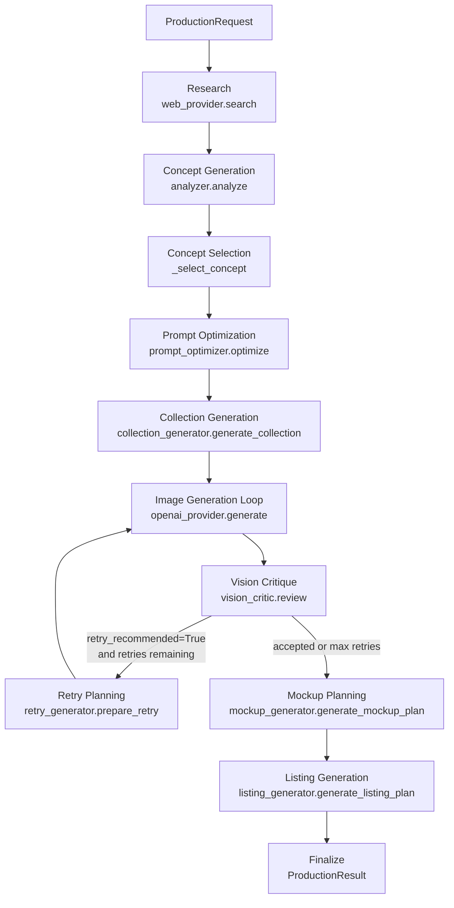
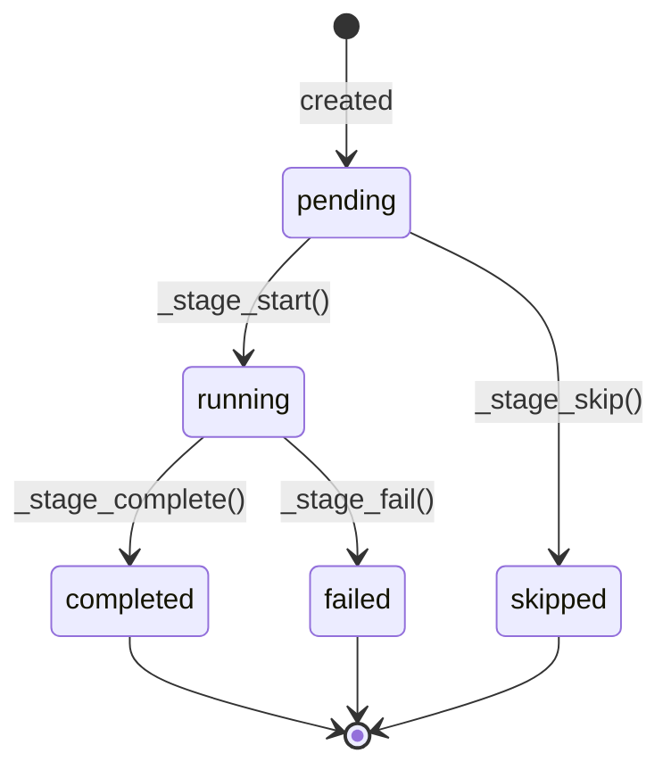
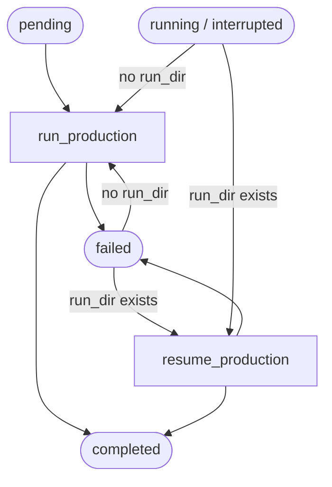

# How It Works

A technical walkthrough of the etsy-ai-agent pipeline for developers.

---

## Pipeline overview



All stages are orchestrated by `run_production()` in `agent/production_orchestrator.py`.

---

## Entry point

```python
# test_production.py
from agent.production_orchestrator import ProductionRequest, run_production

request = ProductionRequest(
    query="cozy anime wall art",
    collection_size=3,        # 3–8 posters
    output_root="outputs",
    selected_concept_index=None,  # None = auto-select first concept
    max_image_retries=1,
    skip_mockups=False,
    skip_listing=False,
)
result = run_production(request)
```

`run_production()` accepts an optional `_deps: ProductionDependencies` parameter — a test seam for injecting fakes without touching the network.

---

## Stage-by-stage breakdown

### Stage 1 — Research

```python
# research/web_provider.py
class WebResearchProvider(ResearchProvider):
    def search(self, query: str, limit: int = 20) -> list[Product]:
```

Uses `ddgs` (DuckDuckGo) to fetch up to 20 results. Each result is normalized into a `Product` dataclass with `.to_dict()`.

**Offline alternative:** `research/mock_provider.py` returns 5 hardcoded cozy/anime products — used for local testing without internet.

---

### Stage 2 — Concept Generation

```python
# agent/analyzer.py
def analyze(
    products: list[dict],
    user_request: str | None = None,  # pins concepts to a specific niche/style
    single_only: bool = False,        # forces single standalone posters, no sets
    count: int = 3,                   # how many concepts to return
    avoid_names: list[str] | None = None,  # names/subjects already used — skip them
) -> dict:
    # Returns: {"poster_concepts": [...]}
```

Single Claude call. Returns `count` poster concept dicts (default 3), each with:
- `name`, `niche`, `art_style`
- `image_generation_prompt`
- `negative_prompt`
- `single_or_set` — `"single"` or `"set"`

**New behaviour:**
- Pass `user_request` to steer concepts toward a specific niche; research data is used only for market signals (pricing, tags), not subject matter.
- Pass `single_only=True` to force every concept to be a standalone poster (`single_or_set = "single"`).
- Pass `avoid_names` to prevent the LLM from re-proposing concepts whose name or subject overlaps with an existing run.
- Concepts default to single posters unless the niche clearly benefits from a series (prompt rule change from "at least 3 sets" to "single unless justified").

---

### Stage 3 — Concept Selection

```python
# agent/production_orchestrator.py
def _select_concept(concepts: list[dict], index: int | None) -> dict:
```

If `selected_concept_index` is `None`, picks `concepts[0]` deterministically.
If an index is provided (1-based), validates range and returns that concept.
Raises `ValueError("out of range")` for invalid indices.

---

### Stage 4 — Prompt Optimization

```python
# agent/prompt_optimizer.py
def optimize(concept: dict, image_prompt: str, negative_prompt: str) -> dict:
    # Returns: {"optimized_image_prompt": ..., "optimized_negative_prompt": ...}
```

Single Claude call. Python post-processes the negative prompt by appending `_NEGATIVE_ADDITIONS` — a hardcoded list of paper/border/watermark phrases — guaranteeing they're always excluded.

---

### Stage 5 — Collection Generation

```python
# agent/collection_generator.py
def generate_collection(
    concept: dict,
    optimized_prompt: str,
    optimized_negative_prompt: str,
    collection_size: int,
) -> CollectionPlan:
```

**Three-call architecture:**

1. **Bible call** — generates `CollectionBible` (shared style, palette, mood, typography rules)
2. **Poster batches** — generates posters in batches of 2 (`_BATCH_SIZE = 2`), injecting prior poster summaries into each batch prompt to prevent duplicates
3. **Evaluation call** — scores the full collection for cohesion

Each batch:
- Calls `_generate_batch()` → `_raw_call()` → `_parse_with_diagnostics()`
- On truncation (`_TruncatedResponseError`), retries once with `_COMPACT_SUFFIX`
- Validates with `_validate_batch()`: index integrity, cross-batch duplicate check (title, subject, unique_hook), tag count (exactly 13), full-bleed terms, prohibited paper phrases

```python
def _make_batches(size: int, batch_size: int = 2) -> list[list[int]]:
    # _make_batches(5) → [[1,2], [3,4], [5]]
```

---

### Stages 6/7/8 — Image Generation + Vision Critique + Retry

These three stages run as an interleaved per-poster loop:

```
for each poster:
    attempt 1:
        generate image  →  vision critique  →  retry plan
        if accepted or max retries reached → save final.png, break
    attempt 2 (if retry):
        generate image  →  vision critique  →  retry plan
        ...
```

**Image generation:**
```python
# image/openai_provider.py
class OpenAIImageProvider(ImageProvider):
    def generate(self, prompt: str) -> str:  # returns path to saved PNG
```
Uses `gpt-image-2`, **1536×2304** (2:3 print ratio), returns `b64_json` (no `response_format` parameter needed).

**Vision critique:**
```python
# agent/vision_critic.py
def review(poster_concept, optimized_prompt, optimized_negative_prompt, image_path) -> VisionReport:
```
Returns a `VisionReport` with 8 scored dimensions (1–10), `retry_recommended: bool`, and `final_recommendation: str` (PROCEED / PROCEED_WITH_IMPROVEMENTS / RETRY).

**Retry planning:**
```python
# agent/retry_generator.py
def prepare_retry(poster_concept, optimized_prompt, optimized_negative_prompt, vision_report) -> RetryPlan:
```
Returns `RetryPlan` with `should_retry: bool`, `revised_image_prompt`, `revised_negative_prompt`.

**Per-poster output:**
```
images/poster_01/
├── original.png          # attempt 1
├── attempt_2.png         # if retried
├── final.png             # copy of last attempt
├── vision_report_1.json
├── retry_plan_1.json
└── attempts.json         # AttemptRecord list
```

---

### Stage 9 — Mockup Planning

```python
# agent/mockup_generator.py
def generate_mockup_plan(collection_plan: CollectionPlan) -> MockupPlan:
```

Two-call architecture:
1. Individual mockup specifications (one per poster)
2. Collection mockup + hero mockup + evaluation

Compositing mode: artwork is referenced by poster index only — never redescribed. Claude specifies scene, furniture, lighting. Validated for immutable-asset language, no-crop/no-stretch constraints, furniture ≤ 1, decor ≤ 2.

If `skip_mockups=True`, this stage and listing generation are both skipped.

---

### Stage 10 — Listing Generation

```python
# agent/listing_generator.py
def generate_listing_plan(collection_plan: CollectionPlan, mockup_plan: MockupPlan) -> ListingPlan:
```

Single Claude call. Produces:
- `listing_title` (≤ 140 chars), `short_title` (40–60 chars)
- `description` (structured sections)
- `bullet_points` (6–10)
- `tags` (exactly 13, each ≤ 20 chars)
- `seo_keywords` (20–40)
- `image_order` (≤ 10 items)
- `faqs` (8–12)
- `evaluation` with confidence score

---

## Ukiyo-e Prompt Generator

A standalone, **zero-LLM** prompt generator for ukiyo-e style art. Every prompt is assembled procedurally from `data/ukiyoe_dataset.json` — no API calls, no tokens spent.

```python
# agent/ukiyoe_prompt_generator.py
from agent.ukiyoe_prompt_generator import UkiyoePromptGenerator

gen = UkiyoePromptGenerator()                      # loads dataset once
prompt_dict = gen.generate_one()                   # single prompt
batch = gen.generate_batch(n=10, diversity=True)   # batch with diversity checks
```

**Selection pipeline (in order):**
genre → style → subject → environment → season → time_of_day → weather → lighting → composition → perspective → movement → palette → mood → symbolism → print_technique → surface_texture

Each step is compatibility-checked against prior picks (e.g. `winter` blocks `rainy-season`, `night` adjusts lighting pool). Genre profiles set weighted priors over every category — a `landscape` genre biases toward mountain/coastal subjects; a `bijin-ga` genre biases toward indoor settings and soft palettes.

**History-aware deduplication:** prompt titles and subjects are tracked in `outputs/.ukiyoe_prompt_history.json`. The generator rejects titles with overlapping trigrams against the last 20 000 entries before returning.

**Diversity validation (batch mode):** rejects a batch if any two prompts share genre + mood + season, or if subject concentration exceeds a threshold. Retries individual slots up to 10 times before giving up.

**Dataset:** `data/ukiyoe_dataset.json` — built by `scripts/build_dataset.py`, validated by `scripts/validate_dataset.py`, distribution reported by `scripts/dataset_distribution_report.py`. See `docs/ukiyoe-dataset.md` for schema.

**Negative prompt** is hardcoded in `NEGATIVE_PROMPT` (borders, mockup elements, modern artifacts, western oil style) — always appended, never LLM-generated.

---

## Manifest lifecycle



Each stage has its own `StageRecord`. The `ProductionManifest` is written to `manifest.json` after every transition. On failure, the original exception is re-raised after the manifest is updated — so earlier stage outputs are always preserved on disk.

---

## Provider abstractions

### Research

```python
# research/base.py
class ResearchProvider(ABC):
    @abstractmethod
    def search(self, query: str, limit: int = 20) -> list[Product]: ...
```

| Provider | Location | Use |
|----------|----------|-----|
| `WebResearchProvider` | `research/web_provider.py` | Live DuckDuckGo search |
| `MockResearchProvider` | `research/mock_provider.py` | Offline, 5 hardcoded products |

### Image

```python
# image/base.py
class ImageProvider(ABC):
    @abstractmethod
    def generate(self, prompt: str) -> str: ...  # returns file path
```

| Provider | Location | Use |
|----------|----------|-----|
| `OpenAIImageProvider` | `image/openai_provider.py` | gpt-image-2 via OpenAI API |
| `MockImageProvider` | `image/mock_provider.py` | Returns a tiny placeholder PNG |

---

## Dependency injection

```python
@dataclass
class ProductionDependencies:
    research_provider_factory: Callable   # () -> provider
    analyze: Callable
    optimize: Callable
    generate_collection: Callable
    image_provider_factory: Callable      # () -> provider
    vision_review: Callable
    prepare_retry: Callable
    generate_mockup_plan: Callable
    generate_listing_plan: Callable
```

Production: `run_production(request)` — `_default_deps()` wires all real modules.
Tests: `run_production(request, _deps=fake_deps)` — no network, no API keys.

---

## Validation rules

| Layer | What is validated |
|-------|-------------------|
| `_validate_request()` | Non-empty query, collection_size 3–8, max_image_retries 0–3, concept_index ≥ 1 |
| `_validate_batch()` | Index integrity, no duplicate title/subject/unique_hook, exactly 13 tags, full-bleed terms, no paper phrases |
| `_validate_score()` | All vision scores must be integers 1–10 |
| Mockup validation | Immutable-asset language, no-crop, no-stretch, furniture ≤ 1, decor ≤ 2 |

---

## Claude API usage

All Claude calls go through `_raw_call()` in `agent/collection_generator.py` or `ask()` in `agent/claude_client.py`.

- Model: `claude-haiku-4-5-20251001` (set in `agent/claude_client.py`)
- `max_tokens`: 8192
- No streaming
- JSON extracted via regex fence stripping + `json.loads()`
- Parse failures raise `RuntimeError` (not `ValueError`) to avoid catching `json.JSONDecodeError`

---

## Resume system (Stage 10.2)

Call `resume_production(run_dir)` to continue an interrupted run from where it stopped.

**How it works:**
1. Loads `request.json` and `manifest.json` from the run directory
2. Validates every completed stage's output file — if missing or corrupt, resets that stage and all downstream stages to `pending`
3. Fast path: if all stages are already `completed` or `skipped`, returns immediately with zero API calls
4. Resets any `running`/`failed` stages to `pending` (treats them as interrupted)
5. Increments `resume_count` and writes the updated manifest, then runs the pipeline
6. Per-poster: skips posters with a valid `final.png`; reconstructs attempt history from loose files if `attempts.json` is missing; counts existing attempts toward `max_image_retries`

**Manifest fields added for resume:**
- `resume_count` — number of times the run has been resumed (0 on first run)
- `last_resumed_at` — ISO timestamp of the most recent resume

Old manifests without these fields are loaded with defaults (`resume_count=0`, `last_resumed_at=None`).

---

## Job queue (Stage 10.3)

`agent/job_queue.py` batches multiple `ProductionRequest` objects into a single persistent queue and processes them one at a time.

### Directory layout

```
queues/my_batch/
  queue.json      ← single source of truth; updated atomically after every transition
  .queue.lock     ← held during run_queue / resume_queue; prevents accidental parallel launches
```

Production outputs stay under the `output_root` configured per request — they are never copied into the queue directory.

### Job lifecycle



### Queue status values

| Status | Meaning |
|--------|---------|
| `pending` | Queue created but no jobs run yet |
| `running` | At least one job is currently executing |
| `completed` | All jobs completed or cancelled |
| `completed_with_failures` | Mix of completed and failed jobs |
| `failed` | All executed jobs failed |
| `paused` | Stopped early due to `stop_on_failure=True`; pending jobs remain |

### run_dir capture

`run_production` accepts an optional `_on_run_dir` callback invoked the moment the run directory is created — before any paid API calls. The queue uses this to persist `run_dir` in `queue.json` immediately, so a failed job can be resumed even if `run_production` never returns.

### Locking

Acquiring `.queue.lock` is the first action of `run_queue`/`resume_queue`. If the file already exists, `QueueLockedError` is raised. The lock is always released in a `finally` block. Remove a stale lock after a crash with:

```bash
python3 scripts/run_queue.py unlock queues/my_batch --force
```

### stop_on_failure behavior

- `stop_on_failure=False` (default): record the failure, continue with the next pending job, final status = `completed_with_failures`
- `stop_on_failure=True`: persist failure state and re-raise the original exception; remaining pending jobs are untouched

### Cancellation

Only `pending` and `failed` jobs can be cancelled. Cancelling is idempotent. Cancelled jobs remain in `queue.json` with `status=cancelled`; their production outputs (if any) are not deleted.

### Schema versioning

`queue.json` carries `"schema_version": 1`. An unknown version raises `QueueSchemaError` immediately on load.

### Output locations

- `queue.json` — persisted in `<queue_dir>/queue.json`; safe to commit if paths are meaningful on the target machine
- Production outputs — under each request's `output_root`; must be copied separately when moving machines
- `queues/` directories contain local absolute paths and **should generally not be committed** unless all machines share the same path layout

---

## Current limitations

- No Etsy API upload — listing JSON must be copied manually
- `IMAGE_API_KEY` env var is reserved but unused; `OPENAI_API_KEY` is always used for images
- Job queue processes one job at a time — no parallel workers

---

---

## Stage 11.1 — Print Export ✅

> Status: **completed** — all tests pass.

Exports `images/poster_XX/final.png` from any production run to standard print sizes at 300 DPI. Pure Pillow — no network, no AI, no API calls.

### Entry point

```python
from agent.print_export import export_prints

result = export_prints(
    "outputs/my_run",
    sizes=["2x3", "A4"],   # subset or None for all 12
    crop_mode="fit",        # "fit" | "fill" | "pad"
    output_format="png",    # "png" | "jpg"
    upscale=False,
    background_color="#FFFFFF",
    overwrite=False,
)
```

Or via CLI:

```bash
python3 scripts/export_prints.py outputs/my_run --sizes 2x3 A4 --format jpg
python3 scripts/export_prints.py outputs/my_run --all --upscale --json
```

### Poster discovery

`_discover_posters()` scans `run_dir/images/` for directories matching `poster_\d+` and returns them in **natural sort order** (poster_1, poster_2, ..., poster_10 — not lexicographic).

### Crop modes

| Mode | Semantics | Implementation |
|------|-----------|----------------|
| `fit` | Show full artwork; pad if ratios differ | Scale to fit inside target, center, fill remainder with `background_color` |
| `fill` | Fill canvas; crop edges equally | Scale to cover target fully, center-crop excess |
| `pad` | Explicit canvas with artwork centered | Identical rendering to `fit`; caller's semantic intent is "explicit background canvas" |

### Upscaling

- `upscale=False` (default): scale factor capped at 1.0. Artwork placed at original size or downscaled; canvas is full target size. Warning recorded in `ExportRecord.warnings`.
- `upscale=True`: LANCZOS enlargement allowed. `ExportRecord.upscaled=True`, `scale_factor` recorded.

### Atomicity

All writes go to a `.tmp` file first, then `os.replace()` to the final path. On error the `.tmp` is cleaned up. Source `final.png` is never modified, moved, or deleted.

### Output structure

```
run_dir/
  exports/
    poster_01/
      2x3/
        poster.png
      metadata.json     ← PosterExportResult as JSON
    export_manifest.json  ← ExportResult summary (schema_version "1.0")
```

### Dataclasses

- `PrintSize` — name, physical dimensions, unit, px_width, px_height
- `ExportRecord` — per-size result with path, DPI, scale_factor, upscaled, warnings
- `PosterExportResult` — per-poster result with source SHA256 and list of ExportRecords
- `ExportResult` — top-level result returned by `export_prints()`

### Validation

`_validate_inputs()` raises `FileNotFoundError` or `ValueError` for: missing run_dir, missing images dir, no poster dirs found, empty sizes list, duplicate sizes, unknown size names, invalid crop_mode, invalid output_format, invalid background_color hex.

Corrupt or unreadable `final.png` files are caught per-poster and added to `PosterExportResult.failed` — they do not crash the entire export.

---

---

## Stage 11.2 / 11.3 — Package Builder & ZIP Export ✅

> Status: **completed** — all tests pass.

Assembles a production run's on-disk outputs into a clean, customer-ready folder and (optionally) a ZIP archive. Pure stdlib + shutil + zipfile — no network, no AI, no API calls.

### Entry point

```python
from agent.package_builder import build_package

result = build_package(
    "outputs/my_run",
    include_prints=True,
    include_mockups=True,
    include_listing=True,
    include_metadata=True,
    create_zip=False,
    overwrite=False,
)
```

Or via CLI:

```bash
python3 scripts/build_package.py outputs/my_run --zip --json
```

### What gets packaged

| Section | Source | Destination |
|---------|--------|-------------|
| Preview Images | `images/poster_XX/final.png` | `Preview Images/poster_XX.png` |
| Printable Files | `exports/poster_XX/<size>/poster.*` | `Printable Files/poster_XX/<size>/poster.*` |
| Mockups | `mockups/**` | `Mockups/**` |
| Listing | `listing/**` | `Listing/**` |
| Metadata | `manifest.json`, `request.json`, `exports/export_manifest.json`, `exports/**/metadata.json` | `Metadata/…` |
| README.txt | Generated automatically | `README.txt` |
| LICENSE.txt | Fixed template | `LICENSE.txt` |
| package_manifest.json | Generated | `package_manifest.json` |

### How it works

1. **Validation** — confirms `run_dir` exists, `images/poster_XX/final.png` present, `exports/` present when `include_prints=True`, `listing/` present when `include_listing=True`.
2. **Section assembly** — each section is built by `_build_*()` helpers that use `shutil.copy2` to preserve metadata. Missing optional sections (mockups) emit a warning but do not fail.
3. **SHA256** — computed for every copied file via `_sha256_of_file()`.
4. **README.txt / LICENSE.txt** — written atomically via `.tmp` + `os.replace()`.
5. **package_manifest.json** — written twice: once before ZIP (without self-hash), once after (with ZIP info). The self-hash in `files` reflects the first write.
6. **ZIP export** (optional) — `zipfile.ZipFile` in deflate mode. Written to `.tmp` then renamed. Stores only relative paths (no absolute paths in archive).

### Output location

```
<run_dir>/packages/package_YYYYMMDD_HHMMSS/
<run_dir>/packages/package_YYYYMMDD_HHMMSS.zip   ← only when create_zip=True
```

### Dataclasses

- `PackageFile` — relative_path, source_path, size_bytes, sha256
- `PackageSection` — name, files, warnings
- `PackageManifest` — full build record (schema_version "1.0")
- `PackageResult` — package_path, zip_path, manifest, warnings, success

### Atomicity

All text and binary writes go via `.tmp` + `os.replace()`. `.tmp` files are cleaned up on failure. Source files are never modified, moved, or deleted.

---

---

## Stage 15.1 — Local Multi-Provider Image Generation

> Status: **completed** — all tests pass.

Adds two local ComfyUI-based image providers as zero-API-cost alternatives to `OpenAIImageProvider`.

### New modules

| Module | Description |
|--------|-------------|
| `agent/providers/comfyui_workflows.py` | Pure workflow builder functions — no network, no filesystem |
| `agent/providers/comfyui_provider.py` | HTTP client + SDXL/FLUX provider subclasses |
| `agent/providers/provider_factory.py` | `create_image_provider(name)` factory function |
| `agent/providers/__init__.py` | Public API exports |
| `scripts/test_image_provider.py` | Manual CLI for health checks, generation, workflow dumps |

### Provider identifiers

| `IMAGE_PROVIDER` value | Class | Cost |
|------------------------|-------|------|
| `openai` | `OpenAIImageProvider` | ~$0.04/image |
| `comfyui_sdxl` | `ComfyUISDXLProvider` | $0.00 |
| `comfyui_flux_schnell` | `ComfyUIFluxSchnellProvider` | $0.00 |

### Architecture

```
agent/providers/
├── __init__.py              — re-exports all public names
├── comfyui_workflows.py     — build_sdxl_workflow(), build_flux_schnell_workflow()
├── comfyui_provider.py      — ComfyUIImageProvider base + SDXL/FLUX subclasses
└── provider_factory.py      — create_image_provider()
```

### SDXL workflow node layout

```
"1"  CheckpointLoaderSimple   ← checkpoint_name
"2"  CLIPTextEncode           ← positive prompt + CLIP from node 1
"3"  CLIPTextEncode           ← negative prompt + CLIP from node 1
"4"  EmptyLatentImage         ← width, height, batch_size
"5"  KSampler                 ← model/positive/negative/latent, seed, steps, cfg
"6"  VAEDecode                ← samples from 5; VAE from node 1 (or node 7 if external)
"7"  VAELoader                ← only present when COMFYUI_SDXL_VAE is set
"9"  SaveImage                ← images from node 6, filename_prefix
```

### FLUX Schnell workflow node layout

FLUX Schnell does NOT use negative prompts — there is no negative conditioning node.

```
"1"   UNETLoader              ← unet_name
"2"   DualCLIPLoader          ← clip_l + t5xxl, type="flux"
"3"   VAELoader               ← vae_name
"4"   CLIPTextEncode          ← positive prompt only
"5"   EmptySD3LatentImage     ← width, height, batch_size
"6"   ModelSamplingFlux       ← model from 1, width, height
"7"   RandomNoise             ← noise_seed
"8"   BasicGuider             ← model from 6, conditioning from 4
"9"   SaveImage               ← images from node 13, filename_prefix
"10"  KSamplerSelect          ← euler
"11"  BasicScheduler          ← model from 6, simple scheduler, steps
"12"  SamplerCustomAdvanced   ← noise/guider/sampler/sigmas/latent
"13"  VAEDecode               ← samples from 12, vae from 3
```

### HTTP implementation

- All HTTP uses `urllib.request` (stdlib only — no requests/httpx)
- POST `/prompt` → submit workflow → returns `prompt_id`
- GET `/history/{prompt_id}` → poll until `outputs` present or timeout
- GET `/view?filename=X&subfolder=Y&type=Z` → download image bytes
- GET `/system_stats` → health check (never submits a prompt)
- Connection refused → `ComfyUIConnectionError`
- Timeout → `ComfyUITimeoutError`
- 4xx/5xx → `ComfyUIResponseError`
- Execution error in history → `ComfyUIExecutionError`
- Empty/corrupt image → `ComfyUIImageValidationError`

### Security constraint

Only localhost addresses are accepted for `COMFYUI_BASE_URL`. LAN IPs, public hostnames, and HTTPS are rejected with `ComfyUIConfigurationError`. This prevents accidental remote connections.

### Cost tracking

Local providers record `api_cost: 0.0` in the `on_usage` callback. The `CostTracker` treats this as a known-zero cost — it does not return `None`, so `total_cost` in the run summary remains a number rather than `null`.

### Config is lazy

Provider config (`COMFYUI_SDXL_CHECKPOINT`, etc.) is only validated on the first call to `generate()` or `health_check()`. Instantiation never fails.

### RTX computer setup checklist

1. Install Python 3.11+ and clone this repo
2. `pip install -r requirements.txt`
3. Install ComfyUI: `git clone https://github.com/comfyanonymous/ComfyUI`
4. Install ComfyUI requirements: `cd ComfyUI && pip install -r requirements.txt`
5. Download SDXL or FLUX model weights into `ComfyUI/models/`
6. Start ComfyUI: `python main.py --listen 127.0.0.1`
7. Set env vars in `.env` (see `.env.example` — ComfyUI section)
8. Test: `python3 scripts/test_image_provider.py --provider comfyui_sdxl --health`

---

## Planned next stages

- **Stage 18** — Etsy API: upload draft listings
- **Stage 19** — A/B runner: generate variation sets

---

See also: [README.md](README.md) · [MIGRATION.md](MIGRATION.md) · [.env.example](.env.example)
